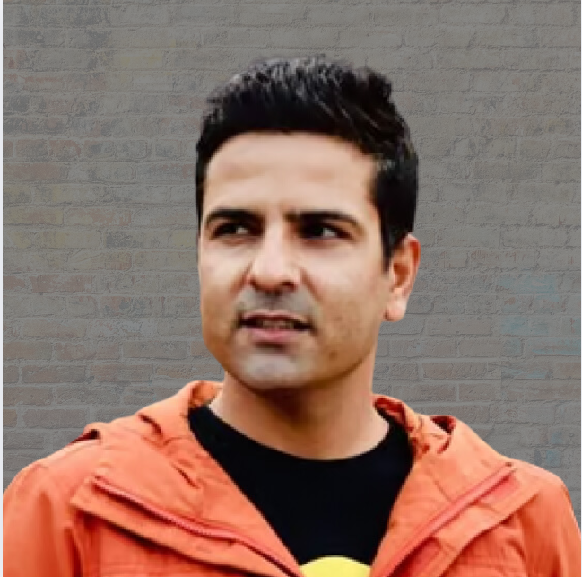

# Dr. Sam Mokhtari

Curriculum Vitae

`email`    [sammokhtari87@gmail.com](mailto:sammokhtari87@gmail.com) |
`homepage` [sammokhtari.com](https://sammokhtari.com) |
`linkedin` [Sam Mokhtari](https://www.linkedin.com/in/sam-mokhtari-59b32971/) |
`github`   [sammk87](https://github.com/sammk87) 

## Career Summary
**With over 15 years of experience in data and AI, I have a proven track record of advising clients on building cloud-native data and AI solutions, supporting more than 100 clients globally across sectors such as financial services, energy, aviation, health, and mining. As a data and AI technologist, I assisted organizations in developing robust  data and AI strategies and solutions, ranging from initial concept to large-scale deployment.
I have a strong background in software development, data analytics, and AI, with a PhD in Electrical and Electronics Engineering. I have also authored several blogs, publications and books on data, AI and cloud topics and delivered public speaking engagements at several events and conferences. 
----------------------------------------------------------------
- Blogs: https://www.sammokhtari.com/blogs
- Videos: https://www.sammokhtari.com/videos 
- Medium Profile: https://medium.com/@sammokhtari
- Research Articles: Check out my google scholar profile
- Mentoring: https://mentorcruise.com/sessions/mentor/sammokhtari/

## Work Experience

### *Since June 2023* Amazon Web Service (AWS) -- Efficiency Lead Solutions Architect, Data and AI (Brisbane, Australia).

Key responsibilities and achievements: 

- Partnered with AWS strategic customers to design and implement high-performance, cost-optimized data platforms and AI solutions.
- Led a team and AWS SMEs (a scaling mechanism) in creating thought leadership material for optimizing compute-intensive cloud workloads.
- Supported AWS strategic customers to adopt AWS services such as AWS Glue, Amazon Bedrock, Amazon Sagemaker and Amazon DataZone.
- Authored AWS Well-Architected Performance Efficiency Pillar.
- Developed AWS Well-Architected Generative AI White-paper.

### *May 2022 -- June 2023* Amazon Web Service (AWS) -- Sustainability Lead Solutions Architect, Data and AI (Brisbane, Australia).

Key responsibilities and achievements:  

- Partnered with AWS customers on large-scale cloud initiatives, ensuring their workloads aligned with environmental goals through sustainable design and implementation.
- Authored 20+ thought leadership materials addressing the intersection of data and analytics, cloud technology and sustainability practices.
- Led a team and AWS SMEs (the scaling mechanism) in creating thought leadership material for optimizing compute-intensive cloud workloads.
- Assisting customers in defining and executing comprehensive sustainability roadmaps, aligning with their unique goals and requirements.
- Developed AWS Well-Architected Sustainability Pillar.
- Supported sustainability initiatives for Deloitte Australia, Wipro, and Syngenta International.

### *August 2022 -- May 2022* Amazon Web Service (AWS) -- Senior Manager, Data and AI (San Francisco, USA).

Key responsibilities and achievements: 

 - Leveraged data and AI expertise to build 5+ prototypes that showcase the art of possible with AWS analytics and AI services.
- Articulated the value proposition of AWS analytics and machine learning services including    AWS Glue, Amazon Athena and Amazon Sagemaker through public speaking and presentations.
- Led a team of designers and cloud engineers to build and implement data and AI prototypes.
- Led development of IDP- Intelligent Document Processing solution resulting in 80 percent reduction in manual processing for insurance clients.
- Architected and implemented Modern Data Architecture for beverage manufacturers, enabling real-time analytics across 600+ data sources.
- Built Rapid Prototyping Portal (RP2), reducing prototype development time by 40 percent.
- Designed and deployed the healthcare provider's HealthLake architecture.
- Built automotive manufacturer's enterprise data lake handling 50TB+ of vehicle telemetry data.
- Implemented end-to-end ML solution for mining customers using Amazon SageMaker, reducing inventory forecasting errors by 35 percent.

### *June 2020 -- August 2021* Amazon Web Service (AWS) -- Senior Solutions Architect, Data and AI (Brisbane, Australia).

Key responsibilities and achievements: 

- Aligned customer data and AI initiatives with their specific business objectives, resulting in over 2 million dollars in cost savings.
- Helped customers to adopt the latest AWS data and AI services such as Amazon Athena, AWS Glue, and Amazon SageMaker to enhance their capabilities.
- Collaborated with customers on architecture and solution design building and deploying modern analytics and machine learning applications on AWS.
- Architected hospitality tech platform's modern data infrastructure enabling real-time analytics for 2000+ restaurants.
- Implemented construction software company's data lake solution reducing data processing time from days to hours.

### *September 2019 -- June 2020* Deloitte -- Specialist Lead, Data and AI (Brisbane, Australia).

Key responsibilities and achievements: 

- Leveraged in-depth knowledge of cloud platforms, data analytics, and machine learning to craft effective client proposals, resulting in six closed deals.
- Led multi-million dollar client engagements to build cloud, analytics, and machine learning solutions, delivering innovation at the intersection of technology and business.
- Supported the career advancement of 6+ junior team members through tailored skill development plans.
- Conducted data maturity assessments and developed roadmaps for enhancing data capabilities.
- Led major banking institution's GCP migration program.
- Built an Azure-based asset management solution for a utility in Australia.
- Established a fast data community of practice leveraging Azure Data Factory, AWS Kinesis and Streamsets, training 100+ practitioners.
- Conducted data maturity assessments and developed roadmaps for enhancing data capabilities.

### *December 2018 -- September 2019* Deloitte -- Manager, Data and AI (Brisbane, Australia).

Key responsibilities and achievements:  

- Led 3 client engagements in data, analytics, and machine learning domains.
- Simplified complex technical concepts into clear, engaging presentations tailored for client audiences, improving understanding and client relations.
- Led a cross-functional teams to design and implement a data platform (data lake and ETL pipelines) for an energy client.
- Built ML-based proactive technical support solutions for major telecommunications providers reduced customer support cases by 35 percent.
- Developed command control center for leading bank enabling real-time monitoring of data pipelines.

### *November 2017 -- December 2018* Deloitte -- Senior Consultant, Data and AI (Brisbane, Australia).

Key responsibilities and achievements: 

- Developed cloud-enabled solutions for customers in analytics and machine learning domains.
- Developed and implemented data and analytics solutions for clients, including data pipelines, ETL, data warehousing, and data governance.
- Provided expert consultation to clients on data strategy, aligning data initiatives with business objectives.
- Conducted performance tuning and optimization of database queries.
- Developed data hub for a major logistics company enabling real-time tracking and analytics of 2000+ fleets.
- Created an enterprise information management platform for utilities provider streamlining data access across 50+ systems.

### *November 2014 -- November 2017* CSIRO -- Postdoc Fellow, Machine Learning (Brisbane, Australia).

Key responsibilities and achievements: 

- Led the development and implementation of advanced machine learning models using data sourced from IoT devices, enabling residents to have independent lives within their smart homes.
- Used data-driven insights to inform the development and refinement of machine learning models.
- Leveraged expertise in machine learning, data science, and IoT technology to deliver technical guidance to both team members and clients.
- Designed big data architecture managing 10TB+ of smart home sensor data across 100+ homes.

### *May 2014 -- November 2014* Avicenna -- Developer (Brisbane, Australia).

Key responsibilities and achievements:  

- Led the design and development of the circuitry for a cutting-edge medical device, ensuring compliance with industry standards and regulations.
- Built real-time visualization of data collected from the medical device, enhancing user engagement and experience.
- Developed Bluetooth-based stethoscope enabling remote patient monitoring and real-time data transmission.

### *August 2011 -- May 2014* Queensland University of Technology -- Researcher, PhD student (Brisbane, Australia).

Key responsibilities and achievements: 

- Conducted research on data-driven solutions to improve the integration of renewable energy in smart grids.
- Developed analytical models to use data and enable more renewable energy in the electricity grid.
- Utilizied IoT technology to collect and analyze data to inform the development of analytical models.
- Published 10+ peer-reviewed papers in top journals and conferences.
- Created data-driven models enabling 20 percent more renewable energy penetration in electricity networks.

### *September 2008 -- August 2011* Amirkabir University of Technology -- Researcher, Msc student (Tehran, Iran).

Key responsibilities and achievements: 

- Conducted research on machine learning-driven solutions to reduce the anomaly of power transformers.
- Developed machine learning models to use data and detect anomalies in power transformers.
- Utilized IoT technology and sensors to collect and analyze data to inform the development of machine learning models.
- Analyzed large sets of data to identify patterns and trends that could inform the development of machine learning models.
- Published 5+ peer-reviewed papers on machine-learning applications for power transformer anomaly detection.

## Education

* August 2011 -- May 2014* Doctor of Philosophy (Ph.D.) in Electrical Engineering -- Queensland University of Technology, Brisbane, Australia.

*September 2008 -- August 20119* Master of Science in Electrical Engineering. Amirkabir University of Technology. Tehran, Iran.

*September 2004 -- September 2008* Bachelor of Science in Electrical Engineering, Ferdowsi University of Mashhad, Mashhad, Iran.

## Skills
**Programming Languages: C, C++, R, Python, Java, SQL, Scala, JavaScript, Matlab, Node.js, HTML, CSS, React, Next.js.
- **DBMS: MySQL, PostgreSQL, MongoDB, Cassandra, Microsoft SQL Server, Oracle DB.
- **Cloud Platforms: AWS, Azure, Google Cloud Platform (GCP), IBM Cloud.
- **Big Data Tools: Hadoop, Spark, Hive, Kafka.
- **Machine Learning Frameworks: TensorFlow, PyTorch, Scikit-learn, Keras.
- **Generative AI: OpenAI GPT models (ChatGPT, Codex), DALL-E, Stable Diffusion, MidJourney, GANs.
- **Agentic AI Tools: LangChain, AutoGPT, BabyAGI, ReAct framework.
- **APIs: REST, GraphQL, OpenAI API, Hugging Face Transformers.
- **Data Analysis and Visualization: Power BI, Tableau, QlikView, Looker, D3.js.
- **AI and ML Tool: Jupyter Notebook, Google Colab, AutoML tools, IBM Watson Studio, Hugging Face Hub.
- **Data Management: Apache Airflow, Snowflake, Databricks.
- **Version Control: Git, GitHub, GitLab, Bitbucket.
- **Agile Project Management: Asana, Slack, Git, JIRA, Microsoft Office.
- **Core Skills: Leadership and Strategic Thinking, Data Governance and Security, Ethical AI Implementation, Expertise in Generative AI Applications, Agentic AI Integration and Development.
- **Functional Skills: Change Management, Stakeholder Management, Business Reporting and Communication, Decision Support and Insight Generation, Agile and Scrum Practices., Developing Generative AI and Agentic AI Use Cases.

## Certifications

- AWS Certified Solutions Architect – Professional
- AWS Certified Solutions Architect – Associate
- AWS Certified DevOps Engineer – Professional
- AWS Certified Developer – Associate
- AWS Certified SysOps Administrator – Associate
- AWS Certified Data Analytics – Specialty
- AWS Certified Machine Learning – Specialty
- AWS Certified Security – Specialty
- AWS Certified Database – Specialty
- AWS Certified Cloud Practitioner
